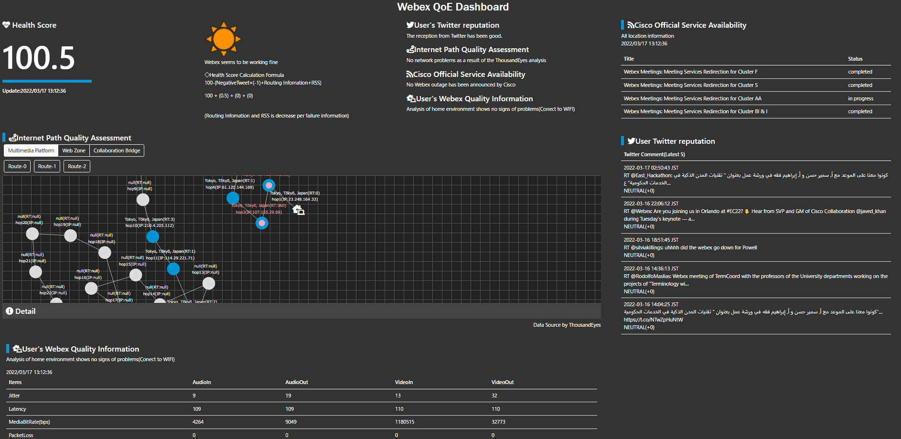

# Webex QoE Dashboard
Webex integrated dashboard that can also detect problem signs from quality visualization.  
QoE is an abbreviation for Quality of the Experience. It means the satisfaction level of a meeting.  


## Overview
Anyone can easily understand the status of Webex and receive signs of problems simply by accessing the dashboard.  
Also, if Webex isn't working properly, you can properly isolate whether it's a home problem, an internet problem, or a service problem. 


## Services of Webex QoE Dashboard



The dashboard was set up in four areas.  
- Health Score：The overall score as QoE and the problems of each analysis result are displayed together.  
- Internet Path Quality Assesment：Display the quality evaluation result of path between the webex user and the server that processes the Webex meeting.  
- Cisco Official Service Availability：Analyze and display Cisco official service operation status and Tweets containing the keyword webex of other users from Twitter.  
- User's Webex Auality Information：Analyzing and displaying the user's latest environmental information.  

## Agenda
- Language and environment
- System Configuration
- Preparation
- Deploy
- How to use


## Language and Environment
Public Cloud Provider: AWS
Function Runtime: Python3.9

## Preparation
### Generate API Token

- Twitter API  
    Apply for an API account at [Developer Platform](https://developer.twitter.com/en/docs/twitter-api).    
    The account used in this system is a free account. The following information is required when applying. 
    * Note: It may take some time from application to granting Developer authority.

- ThousandEyes API<br>
    Refer to the [ThousandEyes DEVELOPER REFERENCE](https://developer.thousandeyes.com/v6/#/authentication) and issue an API Token.  
    A service contract is required to use the ThousandEyes API.  
    To use the API, you need a Token issued with administrator privileges.  


- Webex Meetings Quality API<br>
    Create an administrator account at [Developer Site](https://developer.webex.com/).  
    To use [Webex Meetings Quality API](https://developer.webex.com/docs/api/v1/meeting-qualities), you need a paid service (pro pack) contract.  
    > Reference：To use this endpoint the org needs to be licensed for pro pack.
    To use the Webex Meetings Quality API, you need a Token issued with administrator privileges.

    Set an OAuth Authentication at https://developer.webex.com/docs/integrations.

### ThousandEyes Settings
- Set the route visualization with ThousandEyes at https://app.thousandeyes.com/login.
  - Cloud & Enterprise Agents > Test Settings > Add New Test.
    - Webex Collabration Bridge:
        - Type: Web-HTTP Server
        - URL: Enter Collabration Bridge URL in your environment.
    - Webex DNS Test
        - Type: DNS Server
        - Domain: Enter Webex Domain in your environment.
    - Webex Http Server
        - Type: Web-HTTP Server
        - URL: Enter Webex Site URL in your environment.
    - Webex MultiMedia Platform
        - Type: Network - Agent to Server
        - URL: Enter MultiMedia Platform URL in your environment.
  - Reference: https://docs.thousandeyes.com/product-documentation/internet-and-wan-monitoring/tests

- Set the nortification with ThousandEyes at https://app.thousandeyes.com/login.
  - Alerts
  - Reference: https://docs.thousandeyes.com/product-documentation/alerts

- Check the test ID to be entered in the environment variable of Lambda with a tool such as POSTMAN with API.
  - GET　https://api.thousandeyes.com/v6/tests/http-server
    - API_URL_CD: use Webex Collabration Bridge TEST ID
    - API_URL_HTTP: use Webex Collabration Bridge TEST ID
    - API_URL_WZ: use Webex Http Server TEST ID
    - API_URL_HTTP_WEB: use Webex Http Server TEST ID

  - GET　https://api.thousandeyes.com/v6/tests/agent-to-server
    - API_URL_MMP: use Webex MultiMedia Platform TEST ID
    - API_URL_MMP_NET: use Webex MultiMedia Platform TEST ID

## Deploy

**note: Deploy all resources in the same region except global resources such as IAM.**

### Create function source code .zip archives
Create function source code archive files for uploading to AWS Lambda functions.  
https://docs.aws.amazon.com/lambda/latest/dg/python-package.html  

1. Install latest Python 3.9.x in your local machine. 
2. Git clone this repository or download with archived file and extract it.
3. Go to the repository root directory with a terminal.
4. Download dependency packages with pip.
    ```sh
    pip install -r webexdev-status/requirements.txt -t webexdev-status
    pip install -r webexdev-te/requirements.txt -t webexdev-te
    pip install -r webexdev-twitterapi/requirements.txt -t webexdev-twitterapi
    ```
5. Create archives for each function directories below.
   - webexdev-core
   - webexdev-mtgquality
   - webexdev-status
   - webexdev-te
   - webexdev-twitterapi
    ```sh
    cd {function directory}
    zip -r ../{function directory}.zip .
    ```
    ```sh
    # Example
    cd webexdev-status
    zip -r ../webexdev-status.zip .
    ```
    > This is an example for unix os .zip file archive utility. You can use other third party zip utility (such as 7zip).

### Create an AWS IAM user with administrator access for deployment
1. Create an AWS IAM user with the 'AdministratorAccess' policy referring to the AWS document bellow:  
  [Creating your first IAM admin user and group](https://docs.aws.amazon.com/IAM/latest/UserGuide/getting-started_create-admin-group.html)
2. Sign in with the created IAM user for following sections.
### Create Secrets in AWS Secret Manager
1. Sign in to the AWS Management Console and open the Secret Manager console at
https://console.aws.amazon.com/secretsmanager/home
2. Choose **Store a new secret**, and create new secrets and set the following:
   - Secrets for readonly access
     - Secret Type: Other secret types
     - Secret Key/Value: **Set the keys listed below**
       - hostEmail: Enter webexhost userid 
       - userEmail: Enter webex userid
       - CLIENT_ID: Enter webexadmin clientid  
       - CLIENT_SECRET: Enter webexadmin clientsecret    
       - TE_OAUTHBEARER_TOKEN_V7: Enter ThousandEyes admin token  
       - API_KEY: Enter twitterapi apikey  
       - API_SECRET: Enter twitterapi apisecret  
       - TWITTER_TOKEN: Enter twitterapi token  
       - TWITTER_TOKEN_SECRET: Enter twitterapi tokensecret  
     - Secret Name: `webexdev/secrets`  
   - Secrets for read/write access
     - Secret Type: Other secret types  
     - Secret Key/Value: **Set the keys listed below**
       - ACCESS_TOKEN: Enter webexadmin accesstoken  
       - REFRESH_TOKEN: Enter webexadmin refreshtoken  
     - Secret Name: `webexdev/mtgquality-token`  

### Create a new Amazon S3 bucket
Create a new Amazon S3 bucket to store static files and collected data files.  
https://docs.aws.amazon.com/AmazonS3/latest/userguide/create-bucket-overview.html

1. Sign in to the AWS Management Console and open the Amazon S3 console at https://console.aws.amazon.com/s3/.
2. Choose **Create bucket**.
3. Enter parameters and select options as follows:
    - `Bucket name`: _(Enter a name which is globally unique)_
    - `AWS Region`: _(Select a region which geographically close to the accessing client)_
    - Other parameters and options can be left at their defaults.
4. From the bucket list, choose the bucket you just created.
5. Choose Permissions tab, and choose **Edit** in **Bucket policy**.
6. Copy and paste the following policy and replace the texts enclosed in `{}` depending on your environment:
    ```json
    {
        "Version": "2012-10-17",
        "Statement": [
            {
                "Effect": "Allow",
                "Principal": "*",
                "Action": "s3:GetObject",
                "Resource": "arn:aws:s3:::{Replace this with the bucket name you entered in the previous step}/*",
                "Condition": {
                    "IpAddress": {
                        "aws:SourceIp": [
                            "{Replace this with your accessing client IP address}"
                        ]
                    }
                }
            }
        ]
    }
    ```
7. Choose **Save changes**.
8. Go back to the bucket page, and open **Objects** tab.
9. Choose **Upload**
10. Choose **Add Files** and select **all files** in `s3-files` directory in this repository from local file system.
11. Choose **Upload** to upload files
12. Choose **Add Folder** and select **img** directory in `s3-files` directory in this repository from local file system.
13. Choose **Upload** to upload directory

> Please upload the files and directories separately. Do not upload the 's3-files' folder itself.

### Create Amazon DynamoDB tables
Create Amazon DynamoDB tables for storing data from the cloud service APIs, RSS feeds and Webhooks.  
https://docs.aws.amazon.com/amazondynamodb/latest/developerguide/getting-started-step-1.html

1. Sign in to the AWS Management Console and open the DynamoDB console at https://console.aws.amazon.com/dynamodb/.
2. In the navigation pane on the left side of the console, choose **Dashboard**.
3. On the right side of the console, choose **Create Table**.
4. Enter the table details as follows:
    - Enter **Table name** specified in the table below.
    - Enter **Partition key** specified in the table below.
    - Enter **Sort key - optional** specified in the table below.
    - Leave Default settings selected.
    - Choose **Create** to create the table.
5. **Repeat step 2-4 for the following tables**

| Table name | Description | Partition key | Sort key |
| ------ | ------ | ------ | ------ |
| webexdev-status | Stores data obtained from the Cisco services status RSS feed | title (String) | - |
| webexdev-te | Stores data obtained from the Thousand Eyes API and webhook notifications | datetime (String) | - |
| webexdev-te-polling | Stores data obtained from the Thousand Eyes API by polling regularly | datetime (String) | - |
| webexdev-twitter | Stores Tweet data obtained from Twitter APIs | datetime (Number) | - |
| webexdev-mtgquality | Stores data obtained from the Webex Quality API with administrator privileges | meetingid (String) | useremail (String) |

### Create Access Policy 
1. Sign in to the AWS Management Console and open the IAM console at
https://console.aws.amazon.com/iamv2/home#/policies  
1. Choose IAM Service > Manage Access > Policy and select Create Policy.  
2. Apply the following JSON data and create policies.
   - Allow Dynamo DB access
     - Name: `WebexdevTableAccess`  
       note: Change the `{AWS Region where you created dynamodb table}` and `{AWS Account ID}` parameters according to your environment.  
     - Policy document:
        ```
        {
            "Version": "2012-10-17",
            "Statement": [
                {
                    "Effect": "Allow",
                    "Action": "dynamodb:*",
                    "Resource": [
                        "arn:aws:dynamodb:{AWS Region where you created dynamodb table}:{AWS Accound ID}:table/webexdev-te",
                        "arn:aws:dynamodb:{AWS Region where you created dynamodb table}:{AWS Accound ID}:table/webexdev-te-polling",
                        "arn:aws:dynamodb:{AWS Region where you created dynamodb table}:{AWS Accound ID}:table/webexdev-mtgquality",
                        "arn:aws:dynamodb:{AWS Region where you created dynamodb table}:{AWS Accound ID}:table/webexdev-status",
                        "arn:aws:dynamodb:{AWS Region where you created dynamodb table}:{AWS Accound ID}:table/webexdev-twitter"
                    ]
                }
            ]
        }
        ```
   - Allow Secret Manager get only access
     - Name: `SecretsManagerGetSecretValueONLY`  
     - Policy document:
       ```
       {
           "Version": "2012-10-17",
           "Statement": [
               {
                   "Effect": "Allow",
                   "Action": "secretsmanager:GetSecretValue",
                   "Resource": "*"
               }
           ]
       }
       ```


### Create AWS Lambda functions
Create AWS Lambda Functions and upload scripts to collect data from the cloud service APIs, RSS feeds and Webhooks.  
https://docs.aws.amazon.com/lambda/latest/dg/getting-started-create-function.html

1. Sign in to the AWS Management Console and open the AWS Lambda console at https://console.aws.amazon.com/lambda/home#/functions
2. Choose **Create function**
3. Under **Basic information**, do the following:
   - Enter `Function name` specified in the table below.
   - Select **Python 3.9** in `Runtime`: 
   - Other parameters and options can be left at their defaults.
4. **Repeat step 2-3 for all functions in the table below, using the same options.**
5. From the function list, select the function you just created.
6. Choose **Upload from** right top of the source Code area.
7. Choose **.zip file** and select archived file you have created previous section from your local file system.
8. Choose **Save**
9.  **Repeat step 5-8 for all functions you have created.**
10. From the function list, select the function you just created.
11. Choose **General configuration** in the **Configuration** tab, and choose **Edit**.
12. Set **Timeout** and **Memory** as the value specified in the table below.
13. Choose **Save**.
14. Choose **Triggers** in the **Configuration** tab, and choose **Add trigger**.（Note that some functions don't need triggers）
15. Choose **Select a trigger**, and select '**EventBridge (CloudWatch Events)**'.
16. Select **Create a new rule**.
17. Enter any unique **Rule name**.
18. Select **Schedule expression**.
19. Enter **Schedule expression** specified in the table below.
20. Choose **Add**.
21. Choose **Permissions** in the **Configuration** tab, and open link with the created role name.
22. Choose **Add permissions** in the **Permissions policies** pane, then choose **Attach policies**.
23. Search policies in the **Other permissions policies**, and check all policies specified in the table below.
24. Choose **Attach policies**, and go back to the Lambda console.
26. Choose **Environment valiables** in the **Configuration** tab, and choose **Edit**.
27. Add environment valiables specified in the table below.
28. Choose **Save**.
29. **Repeat step 10-28 for all functions you have created.**

| Function name | Description | Permissions policies | Timeout | Memory | Schedule expression | Environment variables |
| ------ | ------ | ------ | ------ | ------ | ------ | ------ |
| **webexdev-status** | Periodically triggered and retrieves Cisco service status RSS feeds and stores the data in the DynamodDB table | <ul><li>WebexdevTableAccess</li></ul> | 15 sec | Default(128MB) | `rate(5 minutes)` | <ul><li>TZ: (**_Time zone for your location. e.g. Asia/Tokyo_**)</li><li>DYNAMODB_TABLENAME: **webexdev-status**</li></ul> |
| **webexdev-te** | Periodically trrigered, or triggered by Thousand Eyes webhook notifications and stores the data in the DynamodDB table. | <ul><li>WebexdevTableAccess</li><li>AmazonS3FullAccess</li><li>SecretsManagerGetSecretValueONLY</li></ul> | 15 sec | Default(128MB) | `rate(15 minutes)` _(This function is also triggered via API Gateway configured in the following sections)_ | <ul><li>TZ: (**_Time zone for your location. e.g. Asia/Tokyo_**)</li><li>S3_BUCKET_NAME: (_**S3 bucket name you created in the previous section**_)</li><li>DYNAMODB_TABLENAME: **webexdev-te**</li><li>DYNAMODB_TABLENAME_PO: **webexdev-te-polling**</li><li>SECRETMANAGER_NAME: **webexdev/secrets**</li><li>API_URL_MMP: **https://api.thousandeyes.com/v7/net/path-vis/\{Webex MultiMedia Platform TEST ID\}**</li><li>API_URL_WZ: **https://api.thousandeyes.com/v7/net/path-vis/\{Webex Http Server TEST ID\}**</li><li>API_URL_CD: **https://api.thousandeyes.com/v7/net/path-vis/\{Webex Collabration Bridge TEST ID\}**</li><li>API_URL_HTTP: **https://api.thousandeyes.com/v7/net/path-vis/\{Webex Collabration Bridge TEST ID\}**</li><li>API_URL_MMP_NET: **https://api.thousandeyes.com/v6/net/metrics/\{Webex MultiMedia Platform TEST ID\}**</li><li>API_URL_HTTP_WEB: **https://api.thousandeyes.com/v6/web/http-server/\{Webex Http Server TEST ID\}**</li></ul> |
| **webexdev-twitterapi** | Periodically triggered and retrieves data by Twitter APIs and stores the data in the DynamodDB table | <ul><li>WebexdevTableAccess</li><li>SecretsManagerGetSecretValueONLY</li><li>ComprehendFullAccess</li></ul> | 15 sec | Default(128MB) | `rate(15 minutes)` | <ul><li>TZ: (**_Time zone for your location. e.g. Asia/Tokyo_**)</li><li>DYNAMODB_TABLENAME: **webexdev-twitter**</li><li>SECRETMANAGER_NAME: **webexdev/secrets**</li></ul> |
| **webexdev-mtgquality** | Periodically retrieves data by Webex Quality API with administrator privileges, acquires the environment information of participants connected to Webex, and stores data in the DynamodDB table. | <ul><li>WebexdevTableAccess</li><li>SecretsManagerReadWrite</li></ul> | 15 sec | Default(128MB) | - _(This function is designed to be manually triggered when needed)_ | <ul><li>TZ: (**_Time zone for your location. e.g. Asia/Tokyo_**)</li><li>DYNAMODB_TABLENAME: **webexdev-mtgquality**</li><li>SECRETMANAGER_TOKEN_NAME: **webexdev/mtgquality-token**</li><li>SECRETMANAGER_NAME: **webexdev/secrets**</li></ul> |
| **webexdev-core** | Periodically triggered and generate static HTML files and store them in the S3 bucket | <ul><li>WebexdevTableAccess</li><li>AmazonS3FullAccess</li></ul> | 20 sec | 1024MB | `rate(1 minute)` |<ul><li>TZ: (**_Time zone for your location. e.g. Asia/Tokyo_**)</li><li>CLOUDWATCH_URL: (_**Shared URL for the CloudWatch Logs Insight dashboard you created in the next section**_)</li><li>S3_BUCKET_NAME: (_**S3 bucket name you created in the previous section**_)</li><li>SECRETMANAGER_NAME: **webexdev/secrets**</li><li>DYNAMODB_TABLENAME_STATUS: **webexdev-status**</li><li>DYNAMODB_TABLENAME_TEPOLLING: **webexdev-te-polling**</li><li>DYNAMODB_TABLENAME_TWITTER: **webexdev-twitter**</li><li>DYNAMODB_TABLENAME_MTGQA: **webexdev-mtgquality**</li></ul> |

### Create Logs Insight
1. Sign in to the AWS Management Console and open the AWS Lambda console at  
https://console.aws.amazon.com/cloudwatch/home  
2. Choose CloudWatch Service > Logs > Logs Insights.  
3. Choose Query Tab and Create Query.  
4. Create following querys:

- Query Name：`webexdev-te-query alert`  
   Loggroup：`/aws/lambda/webexdev-te`  
   Query Text：  
```
fields @timestamp, @message
| limit 200
| filter @message like /alert/
| fields alert
| display alert.agents.0.dateStart, alert.active ,alert.agents.0.metricsAtStart, alert.testName,alert.agents.0.dateEnd, alert.agents.0.metricsAtEnd
```

- Query Name：`webexdev-te-query metrics`  
   Loggroup：`/aws/lambda/webexdev-te`  
   Query Text：  
```
fields @timestamp, @message
| limit 200
| filter @message like /metrics/
| fields metrics
| display date, jitter, loss, avgLatency, agentName
| stats avg(jitter),avg(loss),avg(avgLatency) by bin(60s)
```

- Query Name：`webexdev-te-query response`  
   Loggroup：`/aws/lambda/webexdev-te`  
   Query Text：  
```
fields @timestamp, @message
| limit 200
| filter @message like /response/
| fields responseTime
| display date, responseTime, agentName
| stats avg(responseTime) by bin(60s)
```
4. Choose Add to dashboard and create new dashboard, then plot 3 queries with graph or table.  
    note: If you don't see the Lambda log group you created, clear your browser's cache.
5. Choose Save Dashboard.  
6. Choose Action > Share Dashboard and select the share button in the item to share the dashboard to the public.
7. Copy the shared link on the dashboard. Make sure you can browse the Dashboard without logging in to the AWS Management Console.
8. **Make a note of the shared link and set it in an environment variable at the `webex-core`Lambda function.**
9. If you want to change the settings later, you can check it from Settings> Share Dashboard.


### Create AWS API Gateway
1. Sign in to the AWS Management Console and open the API Gateway console at  
https://console.aws.amazon.com/apigateway/
2. Choose API GAteway Service > Create API.   
    Select Build from REST API, enter `webexdev` as the API name, and select Create API.
3. Choose Actions> Create Resource and enter `tecloudagent` as the resource name and select Create Resource.  
4. Specify the method POST for the resource name created above. Set `webexdev-te` to the item of the Lambda function.   
5. Confirm that the Lambda function called from API Gateway has been set.  
6. Choose Action > Deploy API.
7. Deploy Stage: Choose New Stage.
 - Enter "release" as stagename.
 - Click Deploy button.
8. Choose Stage > release > / > /tecloudagent > POST, then you can get API Gateway Endpoint URL.
9. Specify this URL if you want to specify the ThousandEyes alert destination.

## How to use
### Access to the Dashboard
1. Sign in to the AWS Management Console and open the Amazon S3 console at https://console.aws.amazon.com/s3/.
2. Choose your created bucket in the deploy section.
3. Choose `index.html` in the listed objects.
4. Copy **Object URL** at the bottom right of the **Object overview**.
5. Access the copied **Object URL** from your browser.
